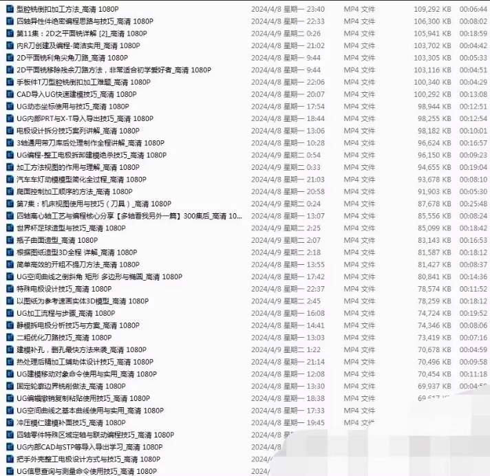
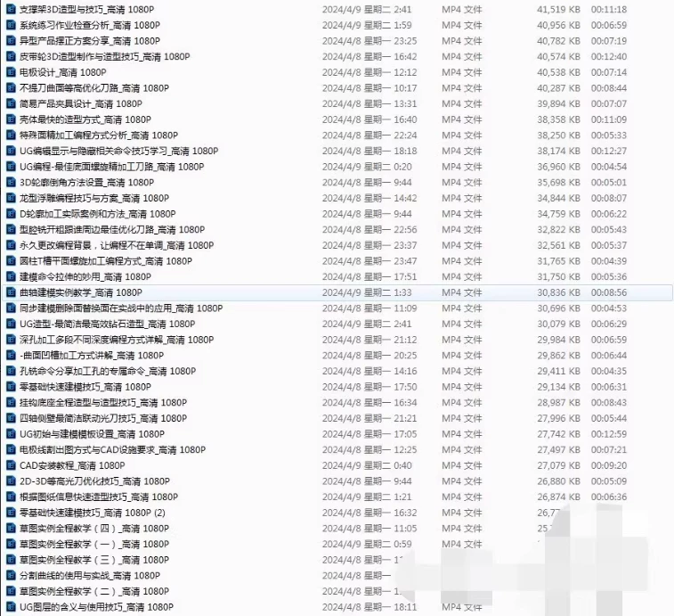

# UG (Unigraphics NX) is a widely used 3D CAD/CAM software in the fields of mechanical design, manufacturing, and engineering analysis. Below are some top-secret video tips on UG software, including modeling, parting, electrode removal, and 3-axis/4-axis programming:

## Body

UG Secret Video Tips, including modeling, parting, disassembling electrodes, 3-axis programming, and 4-axis programming.

(Full product description was not available from the source page.)

## Images

## Payment

Here is a pay link on Stripe ( https://buy.stripe.com/3cs8yP7sY87d0vu9AB ). Please contact me lonlonago@foxmail.com after funding $89, and I will send you a complete data files , thank you!

